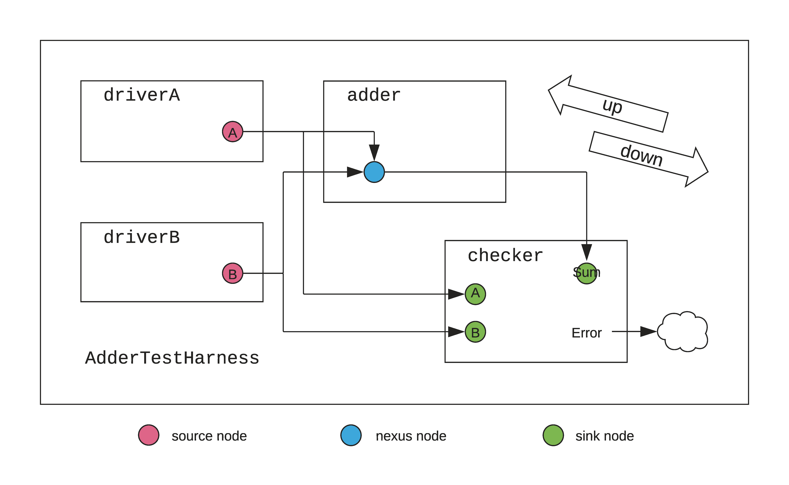
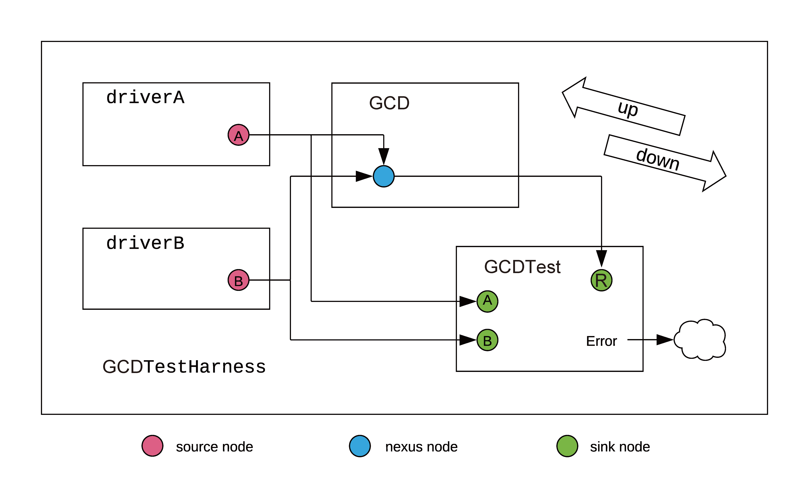

# Diplomacy

> Diplomacy is a parameter negotiation framework for generating parameterized protocol implementations. It does the negotiation **before** hardware generation so the hardware can be parameterized in a better way.

- [Diplomacy](#diplomacy)
  - [Diplomatic Examples](#diplomatic-examples)
    - [Diplomatic Adder](#diplomatic-adder)
      - [Adder: Parameter negotiation](#adder-parameter-negotiation)
        - [Adder: Parameters](#adder-parameters)
        - [Adder: Node Implementation](#adder-node-implementation)
        - [Adder: Nodes](#adder-nodes)
        - [Node Members](#node-members)
      - [Adder: Creating Modules](#adder-creating-modules)
      - [Adder: Creating the Top](#adder-creating-the-top)
    - [Diplomatic GCD](#diplomatic-gcd)
      - [GCD: Node Implementation](#gcd-node-implementation)
      - [GCD: Nodes](#gcd-nodes)
      - [GCD: Creating Modules](#gcd-creating-modules)
      - [GCD: Creating the Top](#gcd-creating-the-top)

## Diplomatic Examples

### Diplomatic Adder



- **Parameters to be negotiated:** Data Width
- **Driver:** Generate input data for `Adder`
- **Adder:** Does the actual adding with multiple input
- **Checker:** Check the result

#### Adder: Parameter negotiation

- Nodes: Send or receive parameter information
- Edges between Nodes: Define and pass negotiation agreement
- Using DAG to define "**upward**"(towards the sinks) and "**downward**"(towards the sources) edges.

##### Adder: Parameters

Define case classes as parameters within the edges

```scala 
case class UpwardParam(width: Int) 
case class DownwardParam(width: Int)
case class EdgeParam(width: Int)
```

##### Adder: Node Implementation

- "node implementation"(`NodeImp`) actually defines how parameters are negotiated between nodes.

> *Source codes from `rocketchip.diplomacy`:*
```scala
abstract class NodeImp[D, U, EO, EI, B <: Data]
  extends Object with InwardNodeImp[D, U, EI, B] with OutwardNodeImp[D, U, EO, B]

abstract class SimpleNodeImp[D, U, E, B <: Data]
  extends NodeImp[D, U, E, E, B]
{
  def edge(pd: D, pu: U, p: Parameters, sourceInfo: SourceInfo): E
  def edgeO(pd: D, pu: U, p: Parameters, sourceInfo: SourceInfo) = edge(pd, pu, p, sourceInfo)
  def edgeI(pd: D, pu: U, p: Parameters, sourceInfo: SourceInfo) = edge(pd, pu, p, sourceInfo)
  def bundle(e: E): B
  def bundleO(e: E) = bundle(e)
  def bundleI(e: E) = bundle(e)
}
```

Generally, every node implementation has to extend `NodeImp` and override function 
- `edgeI`: for trait `InwardNodeImp`, defining Edge Parameters on the inner side of the node.
- `bundleI`: for trait `InwardNodeImp`, defining Bundle type used on the inner side of the node.
- `render`: for trait `InwardNodeImp`, specifying how to render this edge in graphML .
- `edgeO`: for trait `OutwardNodeImp`, defining Edge Parameters on the outer side of the node.
- `bundleO`: for trait `OutwardNodeImp`, defining Bundle type used on the outer side of the node.

`SimpleNodeImp` performs the same parameter negotiation and passes the same bundles along an edge (`edgeO`=`edgeI`=`edge`, `bundleO`=`bundleI`=`bundle`), which can save some typing in our `Adder` case.


- **edge parameter** (`E`) describes the data type that needs to be passed along the edges, in our case, `EdgeParam` class.
- **bundle parameter** (`B`), describes the type of data that will resolve into hardware ports with the negotiated parameter, in our case, `UInt` with negotiated width.

```scala
// PARAMETER TYPES:                       D              U            E          B
object AdderNodeImp extends SimpleNodeImp[DownwardParam, UpwardParam, EdgeParam, UInt] {
  def edge(pd: DownwardParam, pu: UpwardParam, p: Parameters, sourceInfo: SourceInfo) = {
    if (pd.width < pu.width) EdgeParam(pd.width) else EdgeParam(pu.width)
  }
  def bundle(e: EdgeParam) = UInt(e.width.W)
  def render(e: EdgeParam) = RenderedEdge("blue", s"width = ${e.width}")
}
```

The `edge` function does the actual negotiation between nodes, in our case, choosing the smaller width.

The `bundle` function instantiate a diplomatic hardware.

##### Adder: Nodes

For one single node, 
- **inward edges** are ones pointing into the node.
- **outward edges** are ones pointing away from the node.

Every module we defined need nodes to communicate with others.

- Drivers are **sources**, whose nodes should be `SourceNode`s. `SourceNode`s only generate downward-flowing parameters along **outward edges**.
  ```scala
  /** node for [[AdderDriver]] (source) */
  class AdderDriverNode(widths: Seq[DownwardParam])(implicit valName: ValName)
    extends SourceNode(AdderNodeImp)(widths)
  ```

- Checkers are **sinks**, whose nodes should be `SinkNode`s. `SinkNode`s only generate upward-flowing parameters along **inward edges**.
  ```scala
  /** node for [[AdderMonitor]] (sink) */
  class AdderMonitorNode(width: UpwardParam)(implicit valName: ValName)
    extends SinkNode(AdderNodeImp)(Seq(width))
  ```
- Adders receive from Drivers and send to Checker, and the number of inputs and outputs differ, whose nodes should be `NexusNode`s. `NexusNode`s generate both upward-flowing and downward-flowing parameters.
  ```scala
  /** node for [[Adder]] (nexus) */
  class AdderNode(dFn: Seq[DownwardParam] => DownwardParam,
                  uFn: Seq[UpwardParam] => UpwardParam)
                  (implicit valName: ValName)
    extends NexusNode(AdderNodeImp)(dFn, uFn)
  ```


`dFn` defines how this node takes input from **inward edges** and outputs along **outward edges**.
`uFn` defines how this node takes input from **outward edges** and outputs along **inward edges**.

##### Node Members

The node classes of Diplomacy (`SourceNode`, `SinkNode`, `AdapterNode`, `NexusNode`, etc) all extend `MixedNode`. 

```scala
sealed abstract class MixedNode[DI, UI, EI, BI <: Data, DO, UO, EO, BO <: Data](
  val inner: InwardNodeImp [DI, UI, EI, BI],
  val outer: OutwardNodeImp[DO, UO, EO, BO])(
  implicit valName: ValName)
  extends BaseNode with NodeHandle[DI, UI, EI, BI, DO, UO, EO, BO] with InwardNode[DI, UI, BI] with OutwardNode[DO, UO, BO]
```


`MixedNode` can have different types of inward and outward edges and data bundles, possessing the most flexible definition for node implementation. The Nodes' several useful members include:

- `edges`(`edges.in` and `edges.out`)
  ```scala
  protected[diplomacy] lazy val edgesOut = (oPorts zip doParams).map { case ((i, n, p, s), o) => outer.edgeO(o, n.uiParams(i), p, s) }
  protected[diplomacy] lazy val edgesIn  = (iPorts zip uiParams).map { case ((o, n, p, s), i) => inner.edgeI(n.doParams(o), i, p, s) }

  lazy val edges = Edges(edgesIn, edgesOut)
  ```
  `edgesIn: Seq[EI]` is inward edge parameters, while `edgesOut: Seq[EO]` is outward edge parameters. They can be used in `LazyModule`s to fetch the negotiated value of the parameters.
- `in` and `out`
  ```scala
  protected[diplomacy] lazy val bundleOut: Seq[BO] = edgesOut.map(e => Wire(outer.bundleO(e)))
  protected[diplomacy] lazy val bundleIn:  Seq[BI] = edgesIn .map(e => Wire(inner.bundleI(e)))
  def out: Seq[(BO, EO)] = {
    require(bundlesSafeNow, s"${name}.out should only be called from the context of its module implementation")
    bundleOut zip edgesOut
  }
  def in: Seq[(BI, EI)] = {
    require(bundlesSafeNow, s"${name}.in should only be called from the context of its module implementation")
    bundleIn zip edgesIn
  }
  ```
  `in` and `out` are bundles and edge parameters of the inward and outward ports. They are on the basis of a node itself, used in `LazyModule`s to define the output of the module.


#### Adder: Creating Modules

The hardware to be created needs to wait until parameter negotiation is done. To define "lazily" generated module, modules should extend `LazyModule`.

Apart from its nodes, the Chisel hardware for the module must be written inside `LazyModuleImp`. To satisfy parameterized inputs, we use `foreach`, `map` and `reduce` to generate hardware, in this case, the drivers randomly generating numbers for the adder to compute.

```scala
/** driver (source)
  * drives one random number on multiple outputs */
class AdderDriver(width: Int, numOutputs: Int)(implicit p: Parameters) extends LazyModule {
  val node = new AdderDriverNode(Seq.fill(numOutputs)(DownwardParam(width)))
  lazy val module = new LazyModuleImp(this) {
    val negotiatedWidths = node.edges.out.map(_.width)
    require(negotiatedWidths.forall(_ == negotiatedWidths.head), "outputs must all have agreed on same width")
    val finalWidth = negotiatedWidths.head
    // generate random addend (notice the use of the negotiated width)
    val randomAddend = FibonacciLFSR.maxPeriod(finalWidth)
    // drive signals
    node.out.foreach { case (addend, _) => addend := randomAddend }
  }
  override lazy val desiredName = "AdderDriver"
}
```

Since the adder needs only one width value, the partial function passed into `AdderNode` should ensure that the widths are all the same.
```scala
/** adder DUT (nexus) */
class Adder(implicit p: Parameters) extends LazyModule {
  val node = new AdderNode (
    { case dps: Seq[DownwardParam] =>
      require(dps.forall(dp => dp.width == dps.head.width), "inward, downward adder widths must be equivalent")
      dps.head
    },
    { case ups: Seq[UpwardParam] =>
      require(ups.forall(up => up.width == ups.head.width), "outward, upward adder widths must be equivalent")
      ups.head
    }
  )
  lazy val module = new LazyModuleImp(this) {
    require(node.in.size >= 2)
    node.out.head._1 := node.in.map(_._1).reduce(_ + _)
  }

  override lazy val desiredName = "Adder"
}
```

`AdderMonitor` signals an error if the `Adder` returns an incorrect result. It receives the original numbers from Drivers(`nodeSeq`) and the result from Adder(`nodeSum`).

```scala
/** monitor (sink) */
class AdderMonitor(width: Int, numOperands: Int)(implicit p: Parameters) extends LazyModule {
  val nodeSeq = Seq.fill(numOperands) { new AdderMonitorNode(UpwardParam(width)) }
  val nodeSum = new AdderMonitorNode(UpwardParam(width))

  lazy val module = new LazyModuleImp(this) {
    val io = IO(new Bundle {
      val error = Output(Bool())
    })

    // print operation
    printf(nodeSeq.map(node => p"${node.in.head._1}").reduce(_ + p" + " + _) + p" = ${nodeSum.in.head._1}")

    // basic correctness checking
    io.error := nodeSum.in.head._1 =/= nodeSeq.map(_.in.head._1).reduce(_ + _)
  }

  override lazy val desiredName = "AdderMonitor"
}
```

#### Adder: Creating the Top

The top-level module defines the modules discussed above and connects their nodes. Note that the nodes are connected with override connectors `:=`, `:*=`, `:=*` and `:*=*`. Sinks are on the left-hand side, while sources are on the right.

```scala
/** top-level connector */
class AdderTestHarness()(implicit p: Parameters) extends LazyModule {
  val numOperands = 2
  val adder = LazyModule(new Adder)
  // 8 will be the downward-traveling widths from our drivers
  val drivers = Seq.fill(numOperands) { LazyModule(new AdderDriver(width = 8, numOutputs = 2)) }
  // 4 will be the upward-traveling width from our monitor
  val monitor = LazyModule(new AdderMonitor(width = 4, numOperands = numOperands))

  // create edges via binding operators between nodes in order to define a complete graph
  drivers.foreach{ driver => adder.node := driver.node }

  drivers.zip(monitor.nodeSeq).foreach { case (driver, monitorNode) => monitorNode := driver.node }
  monitor.nodeSum := adder.node

  lazy val module = new LazyModuleImp(this) {
    when(monitor.module.io.error) {
      printf("something went wrong")
    }
  }

  override lazy val desiredName = "AdderTestHarness"
}
```

### Diplomatic GCD



- **Parameters to be negotiated:** Data Width
- **Driver:** Generate input data for `Gcd`
- **Adder:** Does the actual calculation with multiple input
- **Checker:** Check the result

#### GCD: Node Implementation

In this example, `Gcd` is a module which requires multiple cycles to compute, thus needing more variables to maintain input/output controls. This means the result `Gcd` outputs to `GcdTest` has more variables than what Drivers outputs to `Gcd`, which is a single number. Therefore, we need to define two node implementation with different edge instantiations.

```scala
class ParamBundle(val w: Int) extends Bundle {
  val number = UInt(w.W)
  val start = Bool()
  val done = Bool()
}

object GcdNodeImp extends SimpleNodeImp[DownwardParam, UpwardParam, EdgeParam, ParamBundle] {
  override def edge(pd: DownwardParam, pu: UpwardParam, p: Parameters, sourceInfo: SourceInfo): EdgeParam = {
    EdgeParam(math.max(pd.width, pu.width))
  }
  override def bundle(e: EdgeParam) = new ParamBundle(e.width)
  override def render(e: EdgeParam) = RenderedEdge("blue", s"width = ${e.width}")
}

object GcdDriverNodeImp extends SimpleNodeImp[DownwardParam, UpwardParam, EdgeParam, UInt] {
  override def edge(pd: DownwardParam, pu: UpwardParam, p: Parameters, sourceInfo: SourceInfo): EdgeParam = {
    EdgeParam(math.max(pd.width, pu.width))
  }
  override def bundle(e: EdgeParam): UInt = UInt(e.width.W)
  override def render(e: EdgeParam): RenderedEdge = RenderedEdge("red", s"width = ${e.width}")
}
```

#### GCD: Nodes

- Drivers are still **sources**, whose nodes should be `SourceNode`s.

- Checkers are **sinks**, whose nodes should be `SinkNode`s. But this time it has to receive parameters from Drivers and `Gcd`.
  ```scala
  class GcdTestInputNode(width: UpwardParam)(implicit valName: ValName)
    extends SinkNode(GcdDriverNodeImp)(Seq(width))

  class GcdTestResultNode(width: UpwardParam)(implicit valName: ValName)
    extends SinkNode(GcdNodeImp)(Seq(width))
  ```
- `Gcd` still receives from Drivers and sends to Checker. However, this time both sides contains different data bundles, which means `GcdNode` should extends `MixedNexusNode`.
  ```scala
  class GcdNode(dFn: Seq[DownwardParam] => DownwardParam,
                uFn: Seq[UpwardParam] => UpwardParam)
               (implicit valName: ValName)
    extends MixedNexusNode(GcdDriverNodeImp, GcdNodeImp)(dFn, uFn)
  ```

#### GCD: Creating Modules

`Gcd` modules are basically the same with `Adder` modules. Their difference mainly lies in the implementation of `LazyModuleImp`, which is pretty much the same as projects without diplomacy.

#### GCD: Creating the Top

When connecting the nodes this time, note that the nodes should be connected on appropriate sides, `MixedNexusNode` requires to match node types. Sinks are on the left-hand side, while sources are on the right.
